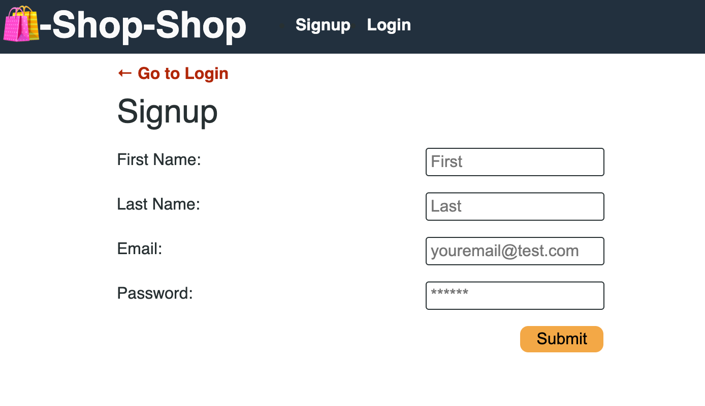
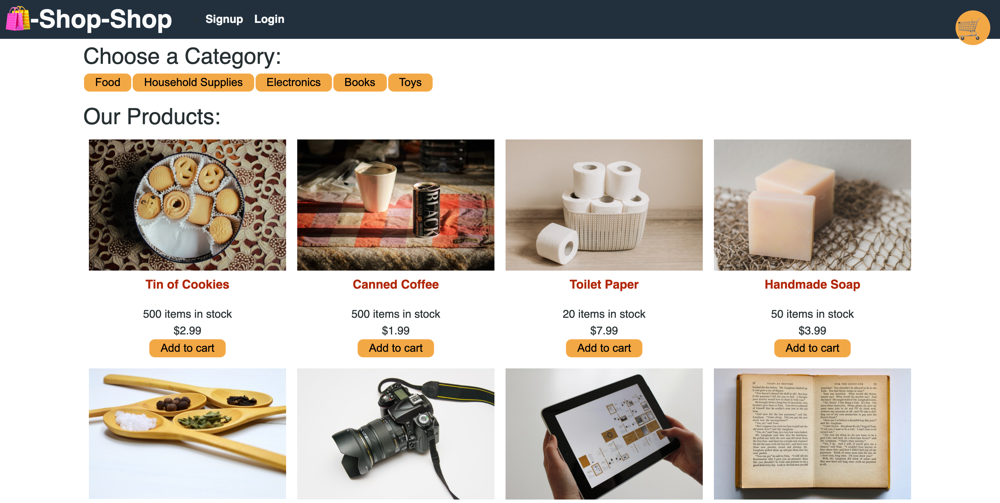
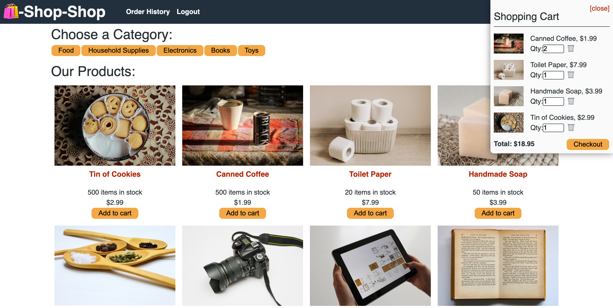

# Shop-Shop

## Live Demo: https://shop-shop-mern.herokuapp.com

## Description
Shop-Shop is an ecommerce MERN application. Users are able to browse items and add them to a cart, which will persist if the website is left. Additionally, users can create an account to keep track of what items they have purchased. The payment processing platform used is Stripe.

## Table of Contents
  - [Usage](#Usage)
  - [Technology Used](#technology-used)
  - [License](#license)
  
## Usage

#### Signup Form:

#### Application Homepage:

#### Shopping Cart:

## Technology Used

 

 

 
  
 
 
   
## License 
  This application uses the MIT license.  
